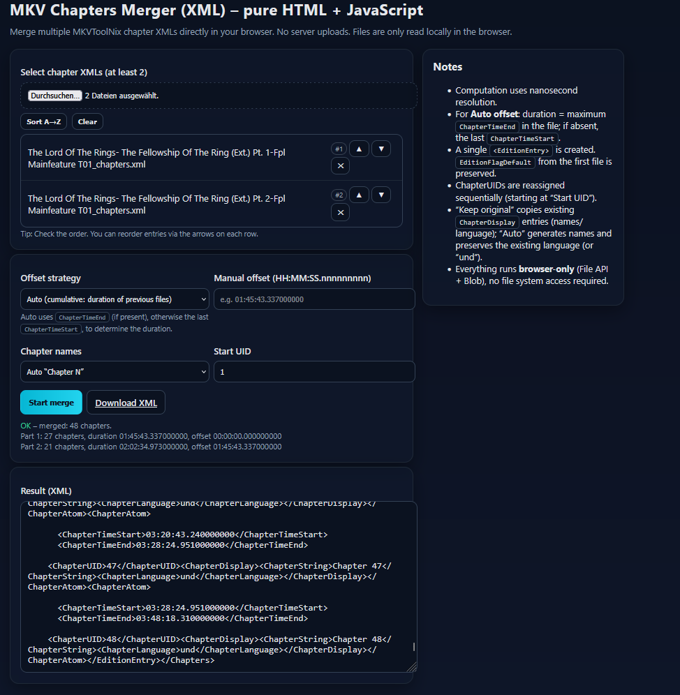

# MKV Chapter Merger

A lightweight, browser-only tool to merge multiple MKVToolNix chapter XML files into one, without any server uploads.



## ✨ Features
- **Browser-only** – all processing happens locally in your browser.
- **Drag & drop / file picker** for selecting multiple `.xml` chapter files.
- **Sorting & manual reordering** of input files.
- **Flexible offset strategies**:
  - Auto (based on duration of previous files)
  - Manual (fixed offset for all but the first)
  - None (append as-is)
- **Chapter name strategies**:
  - Keep original
  - Auto “Chapter N” naming
- **Nanosecond resolution** for accurate timing.
- **Instant download** of merged chapter XML.

## 📦 Installation / Usage
No installation needed — just open the HTML file in your browser.

1. Download or clone this repository:
   ```bash
   git clone https://github.com/<your-username>/mkv-chapter-merger.git
